# UMD Libraries Design System (`umdlib_umdds`)

This document explains how the design system and design tokens work in the
`umdlib_umdds` Drupal theme, how they live in `css/base.css`, and how every
component in `components/` consumes them.

It is the result of reading `css/base.css` end‑to‑end and auditing all
Single‑Directory Components (SDC) under `components/`.

---

## 1. The big picture

The theme uses a **two‑layer token system** with a strict separation of concerns:

```mermaid
flowchart TD
    L1["<b>Layer 1 — PRIMITIVES</b> (raw values)<br/>CSS custom properties in :root → --maryland-red, --space-md<br/>Defined once in css/base.css; re-mapped for .dark-theme"]
    L2["<b>Layer 2 — SEMANTIC UTILITY CLASSES</b> (the design-system surface)<br/>Prefix classes in css/base.css:<br/>c-* color · t-* typography · s-* spacing · ani-* animation · i-* icons"]
    L3["<b>Layer 3 — COMPONENTS (SDC)</b> in components/<br/>*.twig apply utility classes for design-token styling<br/>*.css add ONLY structural/layout CSS (flex, grid, positioning, aspect-ratio),<br/>using var() tokens when raw values are unavoidable"]
    L1 -->|referenced only via var&#40;&#41;| L2
    L2 -->|applied as classes in markup| L3
```



**The golden rule observed across the codebase:** components express _design
intent_ (color role, type ramp, spacing step) through **utility classes in the
Twig template**, and reserve their own `*.css` file for _structural layout_ that
utilities cannot express. When a component CSS file does touch color or spacing
directly, it uses the `var(--token)` primitives — never hard‑coded hex or px.

---

## 2. Layer 1 — Design tokens (primitives)

All primitives are CSS custom properties defined in `css/base.css` `:root`.

### Color tokens

| Token               | Value     | Notes                                                         |
| ------------------- | --------- | ------------------------------------------------------------- |
| `--maryland-red`    | `#e21833` | Brand primary                                                 |
| `--maryland-yellow` | `#ffd200` | Brand secondary (alerts)                                      |
| `--white`           | `#ffffff` |                                                               |
| `--black`           | `#000000` |                                                               |
| `--lightest-gray`   | `#fafafa` |                                                               |
| `--lighter-gray`    | `#f1f1f1` |                                                               |
| `--light-gray`      | `#e6e6e6` |                                                               |
| `--medium-gray`     | `#757575` |                                                               |
| `--dark-gray`       | `#454545` | Default body text                                             |
| `--darker-gray`     | `#242424` |                                                               |
| `--dark-red`        | `#a90007` | Interactive hover (red)                                       |
| `--green`           | `#037623` | Status only (open/available); **not** re‑mapped in dark theme |

The palette is intentionally Maryland‑brand‑only (red / yellow / grayscale).
The single exception is `--green`, reserved strictly for status indicators
(e.g. open/available chips in the chat widget and utility‑status nav) where a
brand color would misread as an error/alert. It is theme‑independent (like the
spacing scale) — it does **not** flip in `.dark-theme`. There is no blue.

### Spacing scale (fixed primitive values)

| Token         | Value    | px  |
| ------------- | -------- | --- |
| `--space-xs`  | `0.5rem` | 8   |
| `--space-sm`  | `1rem`   | 16  |
| `--space-md`  | `1.5rem` | 24  |
| `--space-lg`  | `2rem`   | 32  |
| `--space-xl`  | `3rem`   | 48  |
| `--space-2xl` | `4rem`   | 64  |
| `--space-3xl` | `7.5rem` | 120 |

### Dark theme

`.dark-theme` **re‑maps the same token names** to inverted
values instead of introducing new tokens. This is the key dark‑mode mechanism:

```css
.dark-theme {
  --maryland-red: #ffd200; /* red↔yellow swap */
  --maryland-yellow: #e21833;
  --white: #000000; /* white↔black swap */
  --black: #ffffff;
  --lightest-gray: #242424; /* gray ramp reversed */
  --lighter-gray: #454545;
  --light-gray: #757575;
  --medium-gray: #e6e6e6;
  --dark-gray: #f1f1f1;
  --darker-gray: #fafafa;
}
```

Because every semantic utility and component references `var(--token)`,
**nothing downstream needs dark‑mode‑specific code** — flipping the class on an
ancestor recolors the whole subtree. (The spacing scale is _not_ re‑mapped; it
is theme‑independent.)

### Fonts

Fonts are embedded directly in `css/base.css` as base64 `@font-face`
declarations:

- **Interstate** — the primary UI/body typeface. Declared across weights 100,
  200, 300, 400–500, 600–700, 800, 900–950 (normal + italic variable ranges).
  Stack: `"Interstate", Helvetica, Arial, Verdana, sans-serif`.
- **Barlow Condensed** — used only by the `t-display` style (large italic
  uppercase display text).
- **Crimson Pro** — serif, embedded (weights 300/400+).

> Note: Interstate is a licensed font; the embedded faces fall back to
> Helvetica/Arial.

---

## 3. Layer 2 — Semantic utility classes

These are the actual "design system" surface that components consume. Three
prefixes, each a clean namespace.

### `c-*` — Color

Color utilities map a **semantic role** to a primitive token. The naming is
`c-{property}-{role}` where role is `primary` / `secondary` / `tertiary`,
plus `dark-*` (for use on dark backgrounds) and `interactive-*` (links/buttons,
with `:hover`/`:focus` states).

**Content (text) color**

| Class                             | Maps to                            |
| --------------------------------- | ---------------------------------- |
| `c-content-primary`               | `--black`                          |
| `c-content-secondary`             | `--dark-gray`                      |
| `c-content-tertiary`              | `--medium-gray`                    |
| `c-content-dark-primary`          | `--white` (text on dark bg)        |
| `c-content-dark-secondary`        | `--light-gray`                     |
| `c-content-interactive-primary`   | `--white`                          |
| `c-content-interactive-secondary` | `--black` → hover `--maryland-red` |
| `c-content-interactive-tertiary`  | `--maryland-red`                   |

**Background color**

| Class                           | Maps to                                 |
| ------------------------------- | --------------------------------------- |
| `c-bg-primary`                  | `--white`                               |
| `c-bg-secondary`                | `--lightest-gray`                       |
| `c-bg-tertiary`                 | `--lighter-gray`                        |
| `c-bg-dark-primary`             | `--black`                               |
| `c-bg-dark-secondary`           | `--darker-gray`                         |
| `c-bg-interactive-primary`      | `--maryland-red` → hover `--dark-red`   |
| `c-bg-interactive-secondary`    | `--lightest-gray` → hover `--dark-gray` |
| `c-bg-interactive-dark-primary` | `--darker-gray` → hover `--light-gray`  |

**Border** — `c-border-primary/secondary/tertiary` (1px solid gray ramp) and
`c-border-interactive-primary` (`--maryland-red`, red hover).

**Underline** — `c-underline-primary` (red), `c-underline-secondary` (black),
`c-underline-dark-primary` (light gray). These set a `linear-gradient`
`background-image` consumed by the `ani-underline` animation (see below).

### `t-*` — Typography

A type ramp. Each class sets `font-family`, `font-size`, `font-weight`,
`line-height` (and sometimes transform/letter‑spacing), and importantly applies
to **both the element and its children** via the `.t-x, .t-x *` selector pair —
so wrapping a block tags all descendants.

| Class            | Font             | Size (mobile → ≥768px)         | Weight | Use                                                                       |
| ---------------- | ---------------- | ------------------------------ | ------ | ------------------------------------------------------------------------- |
| `t-display`      | Barlow Condensed | 3rem → 5rem, italic, uppercase | 700    | Display text — page hero **and** in‑component display (e.g. stat numbers) |
| `t-headline`     | Interstate       | 2rem → 3rem                    | 700    | **Page‑level h1 only** — never inside a component                         |
| `t-title-large`  | Interstate       | 1.5rem → 2rem                  | 700    |                                                                           |
| `t-title-medium` | Interstate       | 1.125rem → 1.5rem              | 700    | Card titles                                                               |
| `t-title-small`  | Interstate       | 1rem → 1.125rem                | 700    |                                                                           |
| `t-body-large`   | Interstate       | 1.125rem → 1.5rem              | 400    |                                                                           |
| `t-body-medium`  | Interstate       | 1rem → 1.125rem                | 400    |                                                                           |
| `t-body-small`   | Interstate       | 1rem                           | 400    | Card/list body                                                            |
| `t-interactive`  | Interstate       | 1rem → 1.125rem                | 700    | Links/buttons                                                             |
| `t-label`        | Interstate       | 0.875rem                       | 400    | Dates, captions                                                           |
| `t-eyebrow`      | Interstate       | 0.875rem, uppercase            | 700    | Eyebrows                                                                  |

Plus modifiers: `t-uppercase`, `t-italic`, `t-bold` (all `!important` overrides).

The type ramp scales up at the **768px** breakpoint inside one shared media
block — mobile‑first, single responsive step.

### `s-*` — Spacing

Spacing utilities map to the `--space-*` scale and **bump up one or two steps at
768px / 1024px / 1440px**, so a single class is responsive by design. Four
families:

**Box (padding)** — `s-box-{size}-{axis}`, size `small|medium|large`, axis
`h` (horizontal) / `v` (vertical), with optional `-top` / `-bottom`:

- e.g. `s-box-medium-v` = `padding-block: --space-sm` → `--space-md` at 768px.
- `s-box-medium-h` = `padding-inline: --space-sm` → `--space-md`.

**Page‑level box** — `s-box-page-*` (larger responsive padding for page gutters,
scaling `sm → xl → 2xl → 3xl` across all four breakpoints) plus
`s-page-lock` (`max-width: 1680px`) and `s-center` (`margin: auto`). These build
the centered, gutter‑padded page shell.

**Stack / inline (margins between siblings)**

- `s-stack-{small|medium|large}` → `margin-bottom` (vertical rhythm).
- `s-inline-{small|medium|large}` → `margin-right` (horizontal rhythm).

**Component margins** — `s-margin-general-{small|medium|large}` (bottom margin
between components on a page) and `s-margin-heading-{small|medium|large}`
(top+bottom around headings).

### `ani-*` & icon helpers

- `ani-default` — `transition: all 0.5s`.
- `ani-underline` — animated underline reveal on hover/focus; pairs with a
  `c-underline-*` class that supplies the gradient.
- `ani-bg-interactive` — transitions bg/border/color for interactive surfaces.
- `ani-icon-interactive` — recolors SVG `path` fills on hover (with a
  `path#white` convention for two‑tone icons).
- `i-*` (e.g. `i-chevron`) and `data-lucide` — icon glyph hooks.

---

## 4. Layer 3 — How components consume the system

### Component anatomy (SDC)

Each component is a Drupal Single‑Directory Component:

```
components/umd-libraries-card/
  umd-libraries-card.component.yml   ← schema: name, variants, props, slots
  umd-libraries-card.twig            ← markup; applies utility classes
  umd-libraries-card.css             ← structural layout only
  umd-libraries-card.js              ← behavior (optional)
```

The `.component.yml` declares `variants`, typed `props` (with `enum` +
`default`), and `slots`. Variants drive class selection in Twig (e.g. the card's
`standard` / `overlay` / `icon`).

### The naming conventions used in markup

1. **Namespace + component + BEM element**
   - Root element gets `umd-lib` + the component name: `class="umd-lib card"`,
     `class="umd-lib list"`, `class="umd-lib emphasized-link"`.
   - Internal parts use BEM‑ish `component--element`:
     `card--content`, `card--title`, `card--eyebrow`, `card--image`,
     `person--bio-contact`, `list--description`.
   - These component/BEM classes are the hooks that the component's **own CSS**
     targets for structural layout.

2. **Utility classes carry the design tokens** — applied right alongside the
   BEM classes in the same `class=""` attribute. Example from `card.twig`:

   ```html
   <div
     class="umd-lib card card--{{ variant }} {{ bgClass }}
               c-content-primary s-margin-general-medium"
   >
     <div class="card--content s-box-medium-v {{ contentPadding }}">
       <p class="card--eyebrow t-eyebrow">…</p>
       <h3 class="card--headline s-stack-small t-title-medium">…</h3>
       <div
         class="card--text t-body-small c-content-secondary
                   s-stack-small wysiwyg-editor"
       >
         …
       </div>
       <div class="card--date t-label c-content-tertiary">…</div>
     </div>
   </div>
   ```

   Read it as: BEM class = _what it is_, utility classes = _how it looks_
   (`t-*` type ramp, `c-*` color role, `s-*` spacing step).

3. **Interactive elements stack utilities + animation.** From
   `emphasized-link.twig`:

   ```html
   <a
     class="emphasized-link--text t-body-small t-bold
             c-content-primary c-underline-primary ani-underline"
   ></a>
   ```

   = body type + bold + black text + red underline gradient + animated reveal.

4. **Error / validation UI reuses the system too.** Every component's Twig has a
   fallback branch that renders missing‑field errors using
   `c-content-interactive-primary c-bg-interactive-primary s-box-small-h`
   (white text on Maryland red) — a consistent, tokenized error chip.

### What lives in component `*.css` (and what doesn't)

Component CSS files contain **structural layout only**:

- flexbox / grid, `flex-direction`, `gap`, `align-*`, `justify-*`
- positioning (`position`, the full‑card‑link `::after` overlay trick)
- `aspect-ratio`, `object-fit` for media (`3/2` cards, `1/1` people, `16/9` lists)
- `-webkit-line-clamp` truncation
- component‑specific responsive tweaks at `768 / 1024 / 1440px`

When a component CSS file _does_ set color or spacing, it consistently uses the
**`var(--token)` primitives**, never literals. Examples:

- `umd-libraries-alert.css`: `background-color: var(--maryland-yellow);
border-left: 0.5rem solid var(--maryland-red);`
- `umd-libraries-person.css`: `border-left: 2px solid var(--maryland-red);`
  and `border-bottom: solid 1px var(--light-gray);`
- `umd-libraries-list.css`: `padding: var(--space-md) 0` →
  `var(--space-lg)` at 768px; `border-bottom: 1px solid var(--light-gray);`

This keeps dark‑mode and brand consistency working even in hand‑written CSS.

**Documented literal exceptions.** A few hero/hero‑search colors are deliberately
_not_ tokenized and are commented as such in source: text that sits on a fixed
`rgba(0,0,0,0.6)` image overlay (or the card's gradient scrim), and the
`.hero--overlay.dark-theme` manual override. These surfaces are
theme‑independent, so a flipping `var()` token would invert their intent and
break legibility in dark mode — they are the only intentional hex literals left
in component CSS.

---

## 5. Responsive strategy

Mobile‑first. The system has **one primary breakpoint (768px)** where the type
ramp and most spacing utilities step up, plus secondary breakpoints at
**1024px** and **1440px** used mainly by page‑level spacing (`s-box-page-*`) and
a handful of components. Across `base.css`, `min-width: 768px` dominates (≈27
media blocks) versus a few `1024`/`1440` and a `max-width: 1680px` page cap.

Because responsiveness is **baked into the utility classes**, components rarely
need their own media queries except for layout reflows (e.g. person bio going
row‑wise at ≥768px, list image appearing at ≥768px).

---

## 6. Component inventory & token adoption

Utility‑class adoption across `components/*.twig` (by usage count — higher =
more design‑system‑driven):

- **Heavy adopters** (compose almost entirely from utilities): `umd-libraries-card`,
  `umd-libraries-quote`, `umd-libraries-heading`, `umd-libraries-list`,
  `umd-libraries-info-card`, `umd-libraries-emphasized-link`,
  `umd-libraries-text-callout`, `umd-libraries-section-intro`,
  `umd-libraries-image`.
- **Structural / wrapper components** with little or no utility usage:
  `umd-libraries-layout` (card‑group grid wrapper), `umd-libraries-umdheader`,
  `umd-libraries-utility`, `umd-libraries-chat-widget`,
  `umd-libraries-scroll-to-top` — these are plumbing or third‑party shells.

Most‑used utilities (signal of the system's "defaults"):
`s-box-small-h`, `t-body-small`, `t-label`, `c-content-interactive-primary` +
`c-bg-interactive-primary` (the red interactive pair), `s-stack-small`,
`s-box-medium-h`, `c-content-primary`, `s-margin-general-medium`,
`c-bg-secondary`.

Special cases worth noting:

- `umd-libraries-text` and `umd-libraries-event` carry **Springshare LibCal**
  overrides (`.s-lc-ea-*` selectors) styled to match the token system.
- `umd-www-card` is a thin variant layered on top of `.umd-lib.card` (shares the
  base card structure, adds `card--info` / `card--footer`).
- `.wysiwyg-editor` in `base.css` is a "prose" reset that re‑applies the type
  ramp and spacing tokens to author‑entered HTML (headings, lists, tables) so
  free‑form content matches the system automatically.

---

## 7. How to build / extend a component (the convention)

1. **Create the SDC folder** `components/umd-libraries-<name>/` with
   `.component.yml` (name, group `UMD Libraries`, variants, typed props with
   `enum`+`default`, slots), `.twig`, `.css`, and optional `.js`.
2. **In Twig:** root element = `umd-lib <name>`; internal parts = `<name>--<part>`
   BEM classes.
3. **Style via utilities first:** reach for `t-*` (type), `c-*` (color role),
   `s-*` (spacing). Do **not** hard‑code colors, font sizes, or pixel spacing.
4. **Only write component CSS for layout** the utilities can't express
   (flex/grid/position/aspect‑ratio). If you must set color/spacing there, use
   `var(--token)`.
5. **Add a validation fallback branch** that lists missing required slots using
   the standard red error chip classes.
6. **Trust the breakpoints** in the utilities; add media queries only for
   structural reflow.
7. **Never hard‑code dark‑mode colors** — using `c-*`/`var()` makes
   `.dark-theme` work for free.

---

## 8. Fast component recipe — the styling playbook

This is the practical "how do I style a new component in 60 seconds" guide. It is
derived from how the **existing components actually use the utilities** (usage
counts in parentheses), so following it makes a new component look like it belongs
without inventing anything. It covers the three concerns a component styles with
utilities — **spacing (`s-*`), color (`c-*`), and type (`t-*`)** — in that order.

> The one rule under all three: **express the role, not the raw value.** Pick a
> spacing _step_, a color _role_, and a type _ramp slot_ — never a hex, a pixel, or
> a font size. That is what makes dark mode, brand changes, and responsiveness work
> for free.

### Part A — Spacing: four jobs → four `s-*` families

A component only ever needs to answer four spacing questions. Each maps to exactly
one utility family — never use raw `margin`/`padding` in component CSS for these.

| Job (the question)                                                                       | Family                | What it sets                       | Go‑to value                                            |
| ---------------------------------------------------------------------------------------- | --------------------- | ---------------------------------- | ------------------------------------------------------ |
| 1. Gap **below the whole component** (separating it from the next component on the page) | `s-margin-general-*`  | `margin-bottom`                    | **`s-margin-general-medium`**                          |
| 2. **Padding inside** a filled/bordered surface (the component's "inset")                | `s-box-{size}-{h\|v}` | `padding-inline` / `padding-block` | **`s-box-medium-v` + `s-box-medium-h`**                |
| 3. Gap **between stacked child elements** (vertical rhythm)                              | `s-stack-*`           | `margin-bottom`                    | **`s-stack-small`** (step up to medium between groups) |
| 4. Gap **between inline siblings** (horizontal rhythm)                                   | `s-inline-*`          | `margin-right`                     | usually flex `gap` in CSS — see rule 4                 |

All four families are **responsive by design**: they step up at 768px (and
`s-box-page-*` again at 1024/1440px). You do not add media queries for spacing —
the utility already scales. (See §3 and §5.)

---

### Rule 1 — Component shell: `s-margin-general-medium` on the root (18 components)

Put it on the `umd-lib <name>` root so stacked components breathe. It's the single
most consistent convention in the theme. Gate it behind a `bottom_margin` prop so
the last component in a region can drop it:

```twig
<div class="umd-lib card s-margin-general-medium">
```

### Rule 2 — Inside padding: `s-box-medium-v` + `s-box-medium-h` **for filled surfaces only**

If the component has a background or border (a "card‑like" surface — card content,
accordion child, table cell, callout, info‑card), pad **both axes with medium**.
This pairing is the verified default across every boxed component:

```twig
<div class="card--content c-bg-secondary s-box-medium-v s-box-medium-h"> … </div>
```

- Axis suffixes: `-h` = horizontal (`padding-inline`), `-v` = vertical
  (`padding-block`). Add `-top` / `-bottom` to pad one side only — e.g.
  `s-box-medium-v-bottom` when a header above already paid the top padding.
- **Do not** default to `s-box-small-h`. Its high usage count is the shared error
  chip, **not** content shells. Reserve `large` for hero‑scale surfaces only.
- A component with **no** background (a plain link, a heading, a bare list) usually
  needs **no box padding at all** — it just stacks.
- **Decorative micro-elements (badge / chip / pill) are the exception to the `s-box-*`
  rule.** The `s-box-*` utilities are responsive — they bump up at 768px (e.g.
  `s-box-small-*` goes `0.5rem → 1rem`) — which is right for _content_ but wrong for a
  decoration that should stay the same tiny size everywhere. Give a chip a **fixed**
  `padding: var(--space-xs)` (0.5rem, all sides) in its component CSS instead. This is
  a legitimate §4 case: a non-scaling padding is something the responsive utilities
  _cannot_ express, so you drop to the token. (Still no raw px — use `var(--space-xs)`.)

### Rule 3 — Vertical rhythm: `s-stack-small` is the default; `s-stack-medium` separates _groups_

This is the rule people get wrong. **Most stacked elements use `s-stack-small`** —
eyebrow, headline, title, and body text alike (small ≈ 22 uses vs medium ≈ 10). The
size is **not** chosen by element type; it's chosen by _what's being separated_:

- **`s-stack-small`** — gap between **adjacent lines within one block** (eyebrow →
  headline → text → date). This is your default; reach for it first.
- **`s-stack-medium`** — gap between **distinct logical groups/sections** (e.g.
  `card--details`, `person--bio-top`, `alert--description`, a footer column item,
  a hero display headline). Use it to say "a new section starts here."
- **`s-stack-large`** — rare; only for very large compositional gaps.
- Put the stack class on the element that needs space **below** it. The **last**
  child in a block should have **no** stack class (or an explicit `:last-child`
  reset in CSS) so the box padding controls the bottom edge.

### Rule 4 — Horizontal rhythm: prefer flex `gap`, use `s-inline-*` only as the exception

`s-inline-*` (`margin-right`) is genuinely rare (2 uses total). The theme spaces
horizontal siblings with **`display:flex; gap: var(--space-*)` in the component CSS**,
not utilities. So:

- **Default:** lay rows out with flex + `gap` in `<name>.css`.
- **Exception:** reach for `s-inline-medium` only for a one‑off `margin-right` on a
  sibling that isn't in a flex container (e.g. `event--sign` next to the event text).

### Bonus — Standalone headings: `s-margin-heading-medium`

For a heading that isn't inside a padded surface, `s-margin-heading-*` adds balanced
top **and** bottom margin so it sits correctly between blocks.

---

### Part B — Color: pick a _role_, never a hue

Color utilities are `c-{property}-{role}`. You choose **what the element is for**
(its role); the system decides the actual value and flips it for dark mode. There
are three properties and a small, fixed set of roles.

| Property        | Class                                                            | Role / when to use                                                                   | Resolves to                                        |
| --------------- | ---------------------------------------------------------------- | ------------------------------------------------------------------------------------ | -------------------------------------------------- |
| **Text**        | `c-content-primary`                                              | Default + headings (your go‑to) (21)                                                 | `--black`                                          |
|                 | `c-content-secondary`                                            | Body / supporting copy (13)                                                          | `--dark-gray`                                      |
|                 | `c-content-tertiary`                                             | Meta: dates, captions (3)                                                            | `--medium-gray`                                    |
|                 | `c-content-dark-primary`                                         | Text **on a dark surface** (5)                                                       | `--white`                                          |
| **Background**  | `c-bg-secondary`                                                 | Default card / panel surface (your go‑to) (17)                                       | `--lightest-gray`                                  |
|                 | `c-bg-primary`                                                   | Plain white surface (6)                                                              | `--white`                                          |
|                 | `c-bg-dark-primary`                                              | Dark surface (3)                                                                     | `--black`                                          |
| **Interactive** | `c-content-interactive-primary` **+** `c-bg-interactive-primary` | Buttons / CTAs / the error chip — **always used as a pair** (25 + 25, 100% together) | white text on `--maryland-red`, hover `--dark-red` |

**The four color rules:**

1. **Text = a `c-content-*` role.** Default to `c-content-primary`; drop to
   `secondary` for body copy and `tertiary` for meta. On any dark background, switch
   to the `c-content-dark-*` variants so contrast survives.
2. **A surface gets a `c-bg-*` role, and its text gets the matching `-dark-*`
   role.** `c-bg-secondary` is the default panel; pair `c-bg-dark-primary` with
   `c-content-dark-primary`. Background and its text are chosen **together**.
3. **On a dark surface, EVERY text element carries its own explicit
   `c-content-dark-*` class** — heading, eyebrow, body, caption, all of them. Do
   **not** rely on color inheriting from the dark container: state the dark role on
   each element so the intent is explicit and survives moves/refactors. (Use
   `c-content-dark-primary` for primary text, `c-content-dark-secondary` for muted
   copy.) This is the rule the CTA banner eyebrow originally missed.
4. **Anything clickable/branded uses the interactive pair.** CTAs and the validation
   error chip are always `c-content-interactive-primary c-bg-interactive-primary` —
   they travel together 100% of the time. **Buttons are the exception: don't compose
   them from utilities — use the ready-made `.button.umd-lib` base class (see "Buttons"
   below).** For **links**, combine a text role with an underline:
   `c-content-primary c-underline-primary ani-underline` (red) or
   `c-underline-secondary` (black) — see §3.

Never write a hex or `color:` literal in component CSS for these roles; if CSS must
set a color (a border, say), use the matching `var(--token)` so dark mode still
flips it (see §4 for the only documented literal exceptions).

### Part C — Typography: pick a ramp slot by content role

Type utilities are the **ramp** — each `t-*` sets family + size + weight +
line‑height at once **and cascades to children** (the `.t-x, .t-x *` selector), so
setting body type once on a wrapper tags everything inside it. Pick the slot that
matches the content's role; the responsive step‑up at 768px is already built in.

| Element / role        | Class            | Notes                                                                                  |
| --------------------- | ---------------- | -------------------------------------------------------------------------------------- |
| Eyebrow / kicker      | `t-eyebrow`      | uppercase, bold, small (3)                                                             |
| Card / section title  | `t-title-medium` | the default title (8); `t-title-small` for tighter (8), `t-title-large` for bigger (2) |
| Page h1               | `t-headline`     | **page-level h1 ONLY** — never inside a component                                      |
| In-component display  | `t-display`      | big display text inside a component (e.g. a stat number); also the page hero           |
| Body / content text   | `t-body-small`   | the workhorse body (27); `t-body-medium` when larger (4)                               |
| Dates, captions, meta | `t-label`        | small, regular weight (26)                                                             |
| Links / buttons       | `t-interactive`  | bold interactive ramp (30 — most used)                                                 |

**The three type rules:**

1. **One ramp slot per element, by role** — eyebrow→`t-eyebrow`,
   title→`t-title-medium`, body→`t-body-small`, meta→`t-label`,
   link→`t-interactive`. Don't mix a `t-*` size with a manual `font-size`.
   **`t-headline` is reserved for the page-level h1 — never use it inside a
   component.** For big display text inside a component (a stat number, a feature
   number) use `t-display`.
2. **Set body type on the wrapper, not every child.** Because `t-*` cascades to
   descendants, putting `t-body-small` on the content container styles all the prose
   inside it (this is also how `.wysiwyg-editor` re‑applies the ramp to author HTML).
3. **Modifiers stack on top, sparingly.** `t-bold`, `t-italic`, `t-uppercase` are
   `!important` overrides — add them to a base ramp slot for emphasis (e.g.
   `t-body-small t-bold`), never as a substitute for choosing the right slot.

### Part D — House rules (non-negotiable)

Two cross-cutting rules that apply to every component:

1. **No `border-radius`. Ever.** The brand uses sharp, square corners — `base.css`
   contains **zero** `border-radius` declarations. Do not round buttons, cards,
   chips, images, or anything else. (Where a "pill"-looking element is needed, it
   stays rectangular.)
2. **Buttons are a ready-made base class — never rebuild them.** `base.css` ships the
   complete button at `.button.umd-lib` (primary: white on Maryland red) and
   `.button.umd-lib.secondary` (outlined, with `[disabled]` states). To make a
   button, just apply those classes — `class="umd-lib button"` or
   `class="umd-lib button secondary"`. Do **not** compose a button from `t-*`/`c-*`/
   `s-*` utilities, and do **not** create a button component. It is the one place the
   system provides a finished, self-contained class instead of composable utilities.

---

### Worked example — the canonical card (every utility is S, C, or T)

Read each `class` left‑to‑right as: **what it is** (BEM) → **type** (`t-`) →
**color** (`c-`) → **spacing** (`s-`).

```twig
<div class="umd-lib card s-margin-general-medium          {# S: gap below component #}
            c-content-primary c-bg-secondary">             {# C: default text role + panel surface #}
  <div class="card--content s-box-medium-v s-box-medium-h">{# S: inset padding, both axes #}
    <p  class="card--eyebrow   t-eyebrow      s-stack-small">…</p>   {# T eyebrow · S line gap #}
    <h3 class="card--headline  t-title-medium s-stack-small">…</h3>  {# T title  · S line gap #}
    <div class="card--text     t-body-small c-content-secondary
                s-stack-small wysiwyg-editor">…</div>                 {# T body · C secondary · S gap #}
    <div class="card--date     t-label c-content-tertiary">…</div>   {# T meta · C tertiary · last: no stack #}
  </div>
</div>
```

Note how color and type roles cascade: `c-content-primary` on the root is the
default text color for the whole card, and each child only overrides the role when
it differs (`c-content-secondary` for body, `c-content-tertiary` for the date).

### 60‑second checklist (for humans and AI)

**Spacing (`s-`)**

1. Root = `umd-lib <name>` → add `s-margin-general-medium` (behind a `bottom_margin` prop).
2. Has a background/border? → wrap content in `s-box-medium-v s-box-medium-h`. No surface? → skip box.
3. Each stacked child gets `s-stack-small`; bump to `s-stack-medium` only where a new logical group begins; the **last** child gets none.
4. Horizontal row? → flex + `gap` in CSS. Only use `s-inline-medium` for a stray non‑flex sibling.

**Color (`c-`)**

5. Root surface → `c-bg-secondary` (default panel) + `c-content-primary` (default text).
6. Per child, override the text role only when it differs: body → `c-content-secondary`, meta → `c-content-tertiary`. **On a dark surface, give EVERY text element its own `c-content-dark-*` class — don't rely on inheritance.**
7. CTAs / error chip → the pair `c-content-interactive-primary c-bg-interactive-primary`. Links → text role + `c-underline-primary ani-underline`. **Buttons → the base class `umd-lib button` (or `umd-lib button secondary`), never composed from utilities.**

**Type (`t-`)**

8. One ramp slot per element by role: eyebrow→`t-eyebrow`, title→`t-title-medium`, body→`t-body-small`, meta→`t-label`, link→`t-interactive`. Big in-component display text → `t-display`. **`t-headline` is the page h1 only.**
9. Set body type on the **wrapper** (it cascades to children); add `t-bold`/`t-italic` only as emphasis on top of a slot.

**Always**

10. Never write raw `px`/`rem`, hex colors, or `font-size` for these jobs, and never add spacing/type media queries — the utilities are already role‑based and responsive.
11. **No `border-radius` anywhere** — the brand is square-cornered (`base.css` has none).

---

### TL;DR

`:root` primitives (`--maryland-*`, gray ramp, `--space-*`) → semantic utility
classes (`c-` color, `t-` type, `s-` spacing, `ani-` motion) in `base.css` →
components apply those utilities in Twig for _appearance_ and keep only
_structural layout_ in their own CSS. Dark mode is a single token re‑map; the
responsive system pivots mainly on 768px. Maryland‑brand colors only.
